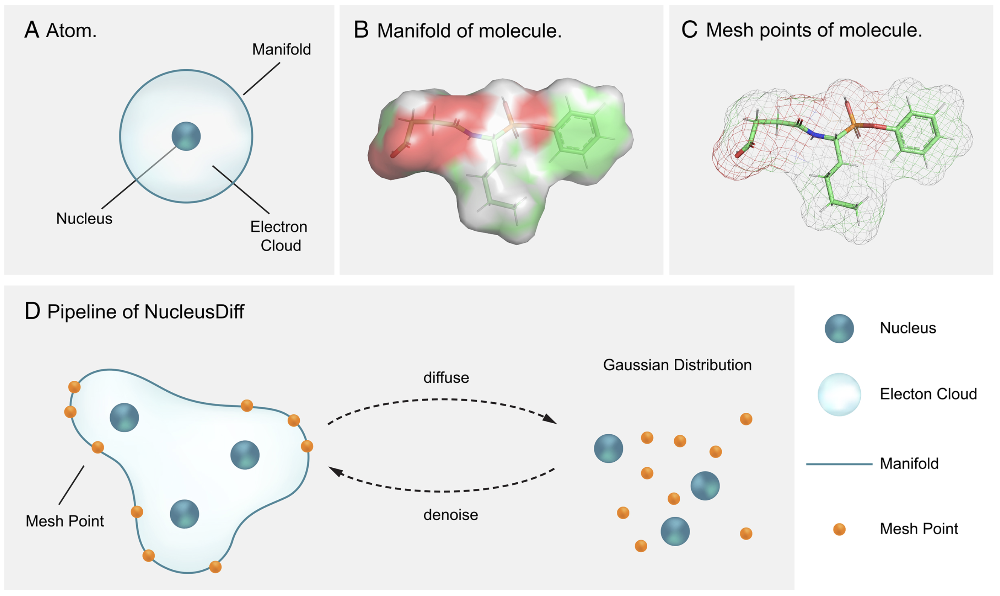

# NucleusDiff: Manifold-Constrained Nucleus-Level Denoising Diffusion Model for Structure-Based Drug Design

[](https://doi.org/10.5281/zenodo.17093932)

This repository is the official implementation of the paper "Manifold-Constrained Nucleus-Level Denoising Diffusion Model for Structure-Based Drug Design".


[[Caltech News]](https://www.caltech.edu/about/news/new-ai-model-for-drug-design-brings-more-physics-to-bear-in-predictions)[[Project Page]](https://yanliang3612.github.io/NucleusDiff/) [[Paper]](https://www.pnas.org/doi/10.1073/pnas.2415666122)  

Authors: Shengchao Liu*, Liang Yan*, Weitao Du, Weiyang Liu, Zhuoxinran Li, Hongyu Guo, Christian Borgs, Jennifer Chayes, Anima Anandkumar

**(*: Equal Contribution)**

**Proceedings of the National Academy of Sciences 2025 (PNAS 2025)**

<p align="center">
   
</p>

<p align="left">
   
</p>

---
## 1. Installation

### 1.1 Dependency for main experiment


The code has been tested in the following environment:

| Package           | Version   |
|-------------------|-----------|
| Python            | 3.8.13    |
| PyTorch           | 1.12.1    |
| CUDA              | 11.0      |
| PyTorch Geometric | 2.5.2     |
| RDKit             | 2021.03.1b1 |


Install via Conda and Pip:

```bash
conda create -n "nucleusdiff" python=3.8.13
source activate nucleusdiff
conda install pytorch==1.12.1 torchvision==0.13.1 torchaudio==0.12.1 cudatoolkit=11.3 -c pytorch
pip install torch_geometric
pip install https://data.pyg.org/whl/torch-1.12.0%2Bcu113/pyg_lib-0.3.1%2Bpt112cu113-cp38-cp38-linux_x86_64.whl
pip install https://data.pyg.org/whl/torch-1.12.0%2Bcu113/torch_cluster-1.6.0%2Bpt112cu113-cp38-cp38-linux_x86_64.whl
pip install https://data.pyg.org/whl/torch-1.12.0%2Bcu113/torch_scatter-2.1.0%2Bpt112cu113-cp38-cp38-linux_x86_64.whl
pip install https://data.pyg.org/whl/torch-1.12.0%2Bcu113/torch_sparse-0.6.16%2Bpt112cu113-cp38-cp38-linux_x86_64.whl
pip install https://data.pyg.org/whl/torch-1.12.0%2Bcu113/torch_spline_conv-1.2.1%2Bpt112cu113-cp38-cp38-linux_x86_64.whl
conda install rdkit/label/nightly::rdkit
conda install openbabel tensorboard pyyaml easydict python-lmdb -c conda-forge
pip install wandb
pip install pytorch-lightning==2.1.3
pip install matplotlib
pip install numpy==1.23
pip install accelerate
pip install transformers


# For Vina Docking
pip install meeko==0.1.dev3 scipy pdb2pqr vina==1.2.2
python -m pip install git+https://github.com/Valdes-Tresanco-MS/AutoDockTools_py3
```
The code should work with PyTorch >= 1.9.0 and PyG >= 2.0. You can change the package version according to your need.


### 1.2 Dependency for preprocessing the crossdock manifold data (we present this special environment if you want to process the manifold dataset from scratch.)
```bash
# We recommend using conda for environment management
conda create -n Manifold python=3.7.3
conda activate Manifold

pip install -r ./crossdock_manifold_data_preparation/requirements.txt
# install PyMesh for surface mesh processing
PYMESH_PATH="~/PyMesh" # substitute with your own PyMesh path
git clone https://github.com/PyMesh/PyMesh.git $PYMESH_PATH 
cd $PYMESH_PATH 
git submodule update --init
apt-get update
# make sure you have these libraries installed before building PyMesh
apt-get install cmake libgmp-dev libmpfr-dev libgmpxx4ldbl libboost-dev libboost-thread-dev libopenmpi-dev
cd $PYMESH_PATH/third_party
python build.py all # build third party dependencies
cd $PYMESH_PATH
mkdir build
cd build
cmake ..
make -j # check for missing third-party dependencies if failed to make
cd $PYMESH_PATH
python setup.py install
python -c "import pymesh; pymesh.test()"

# install meshplot
conda install -c conda-forge meshplot

# install libigl
conda install -c conda-forge igl

# download MSMS
MSMS_PATH="~/MSMS" # substitute with your own MSMS path
wget https://ccsb.scripps.edu/msms/download/933/ -O msms_i86_64Linux2_2.6.1.tar.gz
mkdir -p $MSMS_PATH # mark this directory as your $MSMS_bin for later use
tar zxvf msms_i86_64Linux2_2.6.1.tar.gz -C $MSMS_PATH

# install PyTorch 1.10.0 (e.g., with CUDA 11.3)
conda install pytorch==1.10.0 cudatoolkit=11.3 -c pytorch -c conda-forge
pip install torch-scatter -f https://data.pyg.org/whl/torch-1.10.0+cu113.html

# install Manifold
pip install -e . 
```


---
## 2. Data Preparation

### 2.1 For Crossdock data
1. The data used for training / evaluating the model are organized in the [nucleusdiff_data_and_checkpoint](https://drive.google.com/drive/folders/1boX4IOC-WVJ5zWLy2ulRGvDClN7ukUOe?usp=sharing) Google Drive folder.

2. To train the model from scratch, you need to download the preprocessed lmdb file and split file:
* `crossdocked_v1.1_rmsd1.0_pocket10_processed_w_manifold_data_version.lmdb`
* `crossdocked_pocket10_pose_w_manifold_data_split.pt`

3. To evaluate the model on the test set, you need to download _and_ unzip the `test_set.zip`. It includes the original PDB files that will be used in Vina Docking.

4. If you want to process the dataset from scratch, you need to download CrossDocked2020 v1.1 from [here](https://bits.csb.pitt.edu/files/crossdock2020/), save it into `./data/CrossDocked2020`, and run the scripts in `./crossdock_data_preparation`:
* 1. [clean_crossdocked.py](./crossdock_data_preparation/step1_clean_crossdocked.py) will filter the original dataset and keep the ones with RMSD < 1A.
It will generate a `index.pkl` file and create a new directory containing the original filtered data (corresponds to `crossdocked_v1.1_rmsd1.0.tar.gz` in the drive). *You don't need these files if you have downloaded .lmdb file.*
```bash
    python ./crossdock_data_preparation/step1_clean_crossdocked.py \
           --source "./data/CrossDocked2020" \
           --dest "./data/crossdocked_v1.1_rmsd1.0" \
           --rmsd_thr 1.0
```
* 2. [extract_pockets.py](./crossdock_data_preparation/step2_extract_pockets.py) will clip the original protein file to a 10A region around the binding molecule. E.g.
```bash
    python ./crossdock_data_preparation/step2_extract_pockets.py \
           --source "./data/crossdocked_v1.1_rmsd1.0" \
           --dest "./data/crossdocked_v1.1_rmsd1.0_pocket10"
```
* 3. [split_pl_dataset.py](./crossdock_data_preparation/step3_split_pl_dataset.py) will split the training and test set. We use the same split `split_by_name.pt` as 
[AR](https://arxiv.org/abs/2203.10446) and [Pocket2Mol](https://arxiv.org/abs/2205.07249), which can also be downloaded in the Google Drive - data folder.
```bash
    python ./crossdock_data_preparation/step3_split_pl_dataset.py \
           --path "./data/crossdocked_v1.1_rmsd1.0_pocket10" \
           --dest "./data/crossdocked_pocket10_pose_split.pt" \
           --fixed_split "./data/split_by_name.pt"
```

### 2.2 For Crossdock manifold data
1. switch conda virtual environments
```bash
source activate Manifold
```

2. prepare input for MSMS
```bash
python step1_convert_npz_to_xyzrn.py \
       --crossdock_source [path/to/crossdock_pocket10_auxdata/] \
       --out_root "./data/crossdocked_pocket10_mesh"
```

3. execute MSMS to generate molecular surface
```bash
python step2_compute_msms.py \
       --data_root "./data/crossdocked_pocket10_mesh" \
       --msms-bin [path/to/MSMS/dir]/msms.x86_64Linux2.2.6.1 
```

4. refine surface mesh
```bash
python step3_refine_mesh.py \
       --data_root "./data/crossdocked_pocket10_mesh"
```

### 2.3 Get our final lmdb data and split.pt data
```bash
python ./datasets/pl_pair_dataset.py \
       --data_root "./data/crossdocked_v1.1_rmsd1.0_pocket10"
```

---

## 3. Main experiment

### 3.1 Training
```bash
python train.py \
       --lr 0.001 \
       --device "cuda:0" \
       --wandb_project_name "nucleusdiff_train" \ 
       --loss_mesh_constained_weight 1
```

**Notice:** our pretrained model are organized in the [nucleusdiff_data_and_checkpoint](https://drive.google.com/drive/folders/1boX4IOC-WVJ5zWLy2ulRGvDClN7ukUOe?usp=sharing) Google Drive folder.


### 3.2 Inference (sampling)
```bash
python sample_for_crossdock.py \
       --ckpt_path "./logs_diffusion/nucleusdiff_train" \
       --ckpt_it 100000 \
       --cuda_device 0 \
       --data_id 0 
```

You can also speed up sampling with multiple GPUs, e.g.:
```bash
python sample_for_crossdock.py \
       --ckpt_path "./logs_diffusion/nucleusdiff_train" \
       --ckpt_it 100000 \
       --cuda_device 0 \
       --data_id 0

python sample_for_crossdock.py \
       --ckpt_path "./logs_diffusion/nucleusdiff_train" \
       --ckpt_it 100000 \
       --cuda_device 1 \
       --data_id 1 

python sample_for_crossdock.py \
       --ckpt_path "./logs_diffusion/nucleusdiff_train" \
       --ckpt_it 100000 \
       --cuda_device 2 \
       --data_id 2

python sample_for_crossdock.py \
       --ckpt_path "./logs_diffusion/nucleusdiff_train" \
       --ckpt_it 100000 \
       --cuda_device 3 \
       --data_id 3 
```

### 3.3 Evaluation on the General Metrics 
```bash
python ./evaluation/evaluate_for_crossdock_on_collision_metrics.py \
        --sample_path "./result_output" \
        --eval_step -1 \
        --protein_root "./data/test_set" \
        --docking_mode "vina_dock"
```

### 3.4 Evaluation on the Collision Metrics 
```bash
python ./evaluation/evaluate_for_crossdock_on_collision_metrics.py \
        --sample_path "./result_output" \
        --eval_step -1
```

---

## 4. Advances in Drug Design for COVID-19 and Other Therapeutic Targets

### 4.1 Data Preparation

If you want to process the dataset from scratch, you need to download `real_world.zip` from [nucleusdiff_data_and_checkpoint](https://drive.google.com/drive/folders/1boX4IOC-WVJ5zWLy2ulRGvDClN7ukUOe?usp=sharing), save it into `./data`, and run the scripts in `./covid_19_data_preparation`:

```bash
python ./covid_19_data_preparation/extract_pockets_for_real_world.py \
        --source "./data/real_world" \
        --dest "./real_world_test_extract_pockets"
```
### 4.2 Inference (sampling)

```bash
python sample_for_covid_19.py \
        --checkpoint [path/to/nucleusdiff/checkpoint] \
        --pdb_path "./real_world_test_extract_pockets/CDK2/cdk2_ligand_pocket10.pdb" \
        --result_path "./read_world_cdk2_test" \
        --sample_num_atoms "real_world_testing" \
        --inference_num_atoms 30
```

### 4.3 Evaluation on the General Metrics 
```bash
python ./evaluation/evaluate_for_covid_19_on_general_metrics.py \
        --sample_path "./read_world_cdk2_test" \
        --protein_root "./real_world/cdk2_processed.pdb" \
        --ligand_filename "CDK2" \
        --docking_mode "vina_dock"
```

### 4.4 Evaluation on the Collision Metrics 

```bash
python ./evaluation/evaluate_for_covid_19_on_collision_metrics.py \
        --sample_path "./read_world_cdk2_test" \
        --model "nucleusdiff_train" \
        --target "cdk2_test"
```

## 5. Universal Inference for a Specified Protein

Use `sample_for_specific_protein.py` to generate ligands for an arbitrary single protein pocket PDB.

### 5.1 Input Preparation
1. Prepare a pocket PDB centered at the binding site (e.g., 10 Å around the ligand or binding residues).  
   You may reuse the script in 4.1: `./covid_19_data_preparation/extract_pockets_for_real_world.py`.
2. Example pocket file: `./specific_protein/3cl_ligand_pocket10.pdb`.

### 5.2 Inference (sampling)
```bash
python sample_for_specific_protein.py \
        --checkpoint ./checkpoints/nucleusdiff_pretrained_model.pt \
        --pdb_path ./specific_protein/3cl_ligand_pocket10.pdb \
        --result_path ./results_specific_protein \
        --sample_num_atoms real_world_testing \
        --inference_num_atoms 30 \
        --num_samples 1000 \
        --num_steps 1000 \
        --device cuda:0
```

Key arguments:
- `--checkpoint`: path to a NucleusDiff checkpoint (`.pt`).
- `--pdb_path`: pocket PDB for your target protein.
- `--result_path`: output directory.
- `--sample_num_atoms`: set to `real_world_testing` to use a fixed atom count.
- `--inference_num_atoms`: atoms per generated ligand when using `real_world_testing`.
- `--num_samples`: number of ligands to generate.
- `--num_steps`: diffusion steps (trade-off between quality and speed).
- `--device`: GPU device, e.g., `cuda:0`.

### 5.3 Outputs
- `${result_path}/sample_{test_time}.pt`: raw tensors and sampling trajectories.
- `${result_path}/sdf/*.sdf`: reconstructed molecules in SDF format.

Run `python sample_for_specific_protein.py --help` for the complete list of options and defaults.

---
## Cite Us 

Feel free to cite this work if you find it useful to you!

```bash
@article{liu2025manifold,
  title={Manifold-constrained nucleus-level denoising diffusion model for structure-based drug design},
  author={Liu, Shengchao and Yan, Liang and Du, Weitao and Liu, Weiyang and Li, Zhuoxinran and Guo, Hongyu and Borgs, Christian and Chayes, Jennifer and Anandkumar, Anima},
  journal={Proceedings of the National Academy of Sciences},
  volume={122},
  number={41},
  pages={e2415666122},
  year={2025},
  publisher={National Academy of Sciences}
}
```
